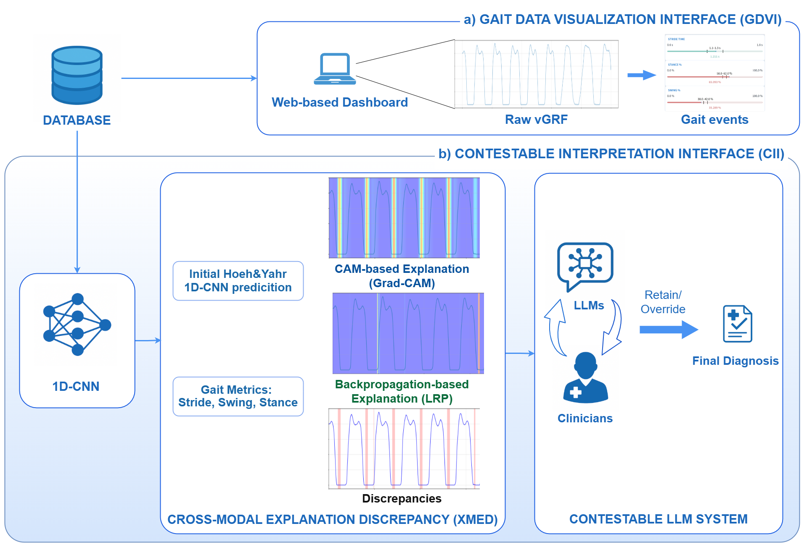

<p align="center">
  <h1 align="center">Motion2Meaning</h1>
  <h3 align="center">A Clinician-Centered Framework for Contestable AI in Parkinson’s Gait Interpretation</h3>
</p>

<p align="center">

  <!-- Paper (ResearchGate DOI) -->
  <a href="https://doi.org/10.13140/RG.2.2.28524.01923">
    
  </a>

  <!-- Dataset -->
  <a href="https://physionet.org/content/gaitpdb/1.0.0/">
    
  </a>

  <!-- Web-based Framework (Gradio link) -->
  <a href="https://www.gradio.app/">
    
  </a>

  <!-- Language -->
  
</p>

## Overview

<p align="center">
  
</p>

**Motion2Meaning** is a clinician-centered, contestable AI framework for interpreting Parkinson’s Disease (PD) gait data.   
It integrates **wearable sensor analysis, explainable AI (XAI), and contestable system design** into a single workflow that prioritizes transparency, accountability, and human oversight.


## Key Features
- **Gait Data Visualization Interface (GDVI)**  
  Interactive web-based tool to explore raw vertical Ground Reaction Force (vGRF) signals with stride, stance, and swing markers.

- **1D-CNN Diagnostic Pipeline**  
  End-to-end prediction of **Hoehn & Yahr severity scores** from raw gait signals.

- **Cross-Modal Explanation Discrepancy (XMED)**  
  Compares Grad-CAM and LRP explanations to detect inconsistent or unreliable model predictions.

- **Contestable Interpretation Interface (CII)**  
  A dashboard for clinicians to review, challenge, and override AI outputs.  
  - Structured **“Contest & Justify” workflow**  
  - LLM-powered justifications grounded in clinical evidence  
  - Immutable logging of disagreements and resolutions  

## Installation & Usage
1. Clone the repository:
   ```bash
   git clone https://github.com/hungdothanh/motion2meaning.git
   cd motion2meaning
   ```
2. Install dependencies:
   ```
   pip install -r requirements.txt
   ```

3. Configure LLM API keys (required for the Contestable LLM interface):
  Open [`chatbox.py`](https://github.com/hungdothanh/motion2meaning/blob/main/chatbox.py) and add your own keys/endpoints for GPT and your Hugging Face deployment.
    ```
    OPENAI_API_KEY = "sk-..."          # your OpenAI / GPT-style key
    HF_API_TOKEN   = "hf_..."          # your Hugging Face access token
    ```

4. Run the web-based dashboard:
   ```
   python app.py
   ```
